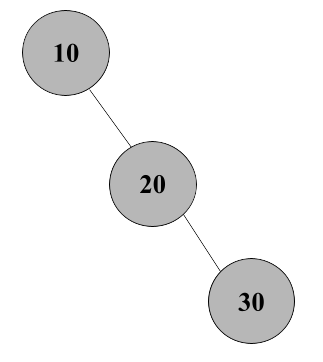
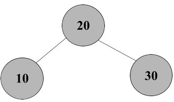
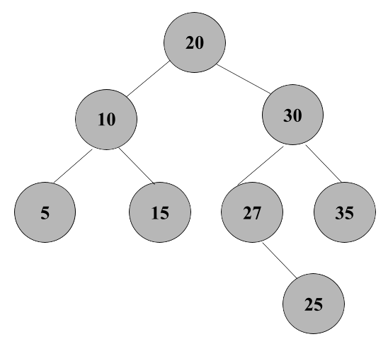
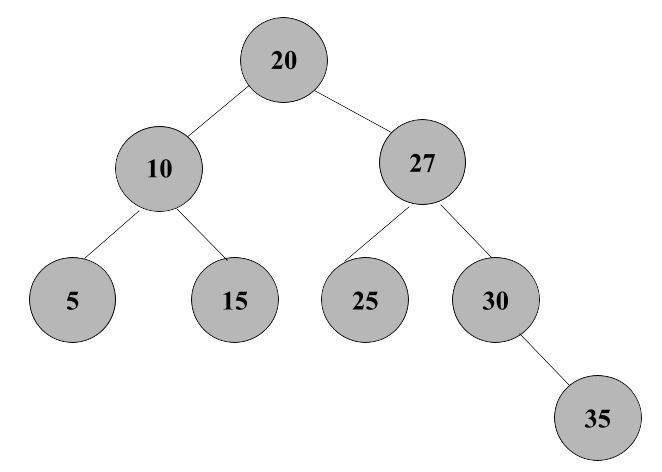

# Insert the following values in order:
**10, 20, 30, 15, 25, 5, 35, 27**

------------------------------------------------------------------------------------
## Insert 10

- Insert 10 into the empty tree; *the root*

## Insert 20

- 20 is greater than 10, so 20 is the right child of 10 

  - Balance factor of 10: 0 - 1 = -1 ; *no rotation needed*

## Insert 30

- 30 is greater than 10 and 20, so 30 is the right child of 20

  - Balance factor of 10: 0 - 2 = -2 ; *left rotation needed*

### After the Rotation

### Insert 15, 25, 5, 35, 27

- Insert 15 as 10's right child

- Insert 25 as 20's left child

- Insert 5 as 10's left child

- Insert 35 as 20's right child

- Insert 27 as 25's right child

### Balance out the AVL Tree

- 25 is the parent of 27, but is less than 27. So we'd swap them. 

Notice the unbalanced tree so a Right-Right Rotation will be performed:

