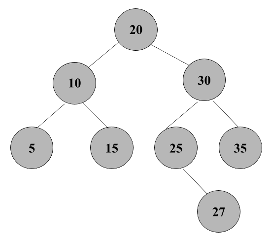

## Insert the following values in order:
10, 20, 30, 15, 25, 5, 35, 27

------------------------------------------------------------------------------------
### Insert 10, 20, 30

- Insert 10 

- Insert 20 as 10's right child 

- Insert 30 as 20's right child 

**Notice the unbalanced tree** so a Right-Right Rotation will be performed:

### Insert 15

- Insert 15 as 10's right child

- Insert 25 as 20's left child

- Insert 5 as 10's left child

- Insert 35 as 20's right child

- Insert 27 as 25's right child

