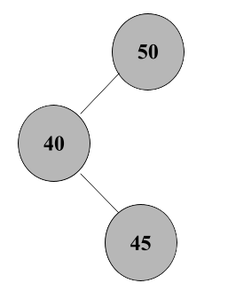
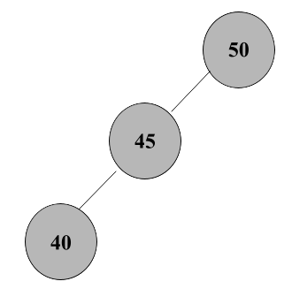
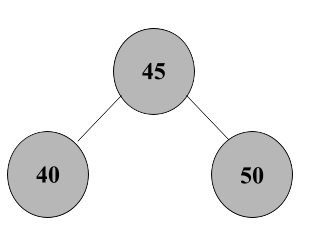
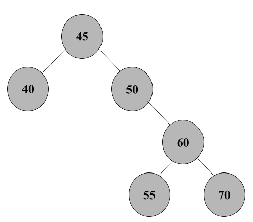
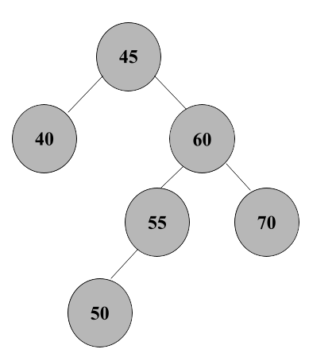
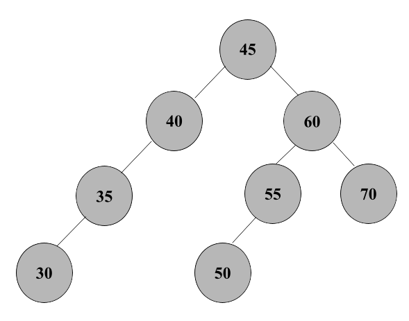
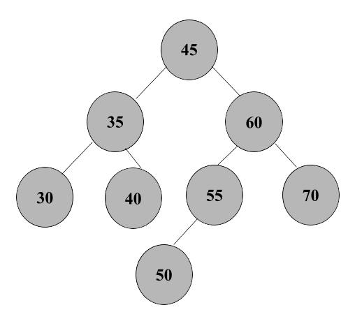
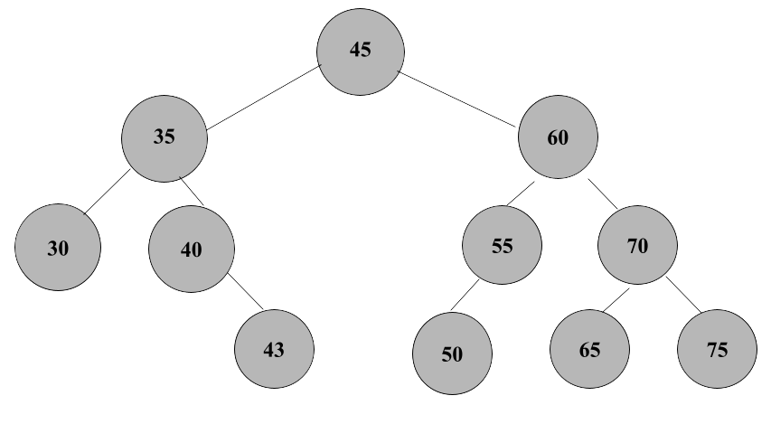

## Insert the following values in order:
50, 40, 45, 60, 55, 70, 35, 30, 65, 75, 43

------------------------------------------------------------------------------------
## Insert 50

- Insert 50 into the empty tree ; *the root*

## Insert 40

- 40 is less than 50, so 40 is the left child of 50 
  - Balance factor of 50: 1 - 0 = 1 ; *no rotation needed*

## Insert 45

- 45 is less than 50 and greater than 40, so 45 is the left child of 40
  - Balance factor of 50: 2 - 0 = 2 ; *left-right rotation needed*

### After the Left Rotation on 40

### After the Right Rotation on 50

## Insert 60
 - 60 is greater than 45 and 50, so 60 is the right child of 50
  - Balance factor of 45: 1 - 1 = 0 ; *no rotation needed*

## Insert 55
## Insert 70

