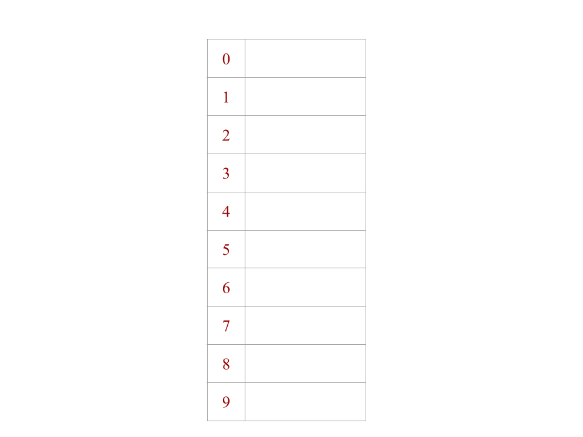
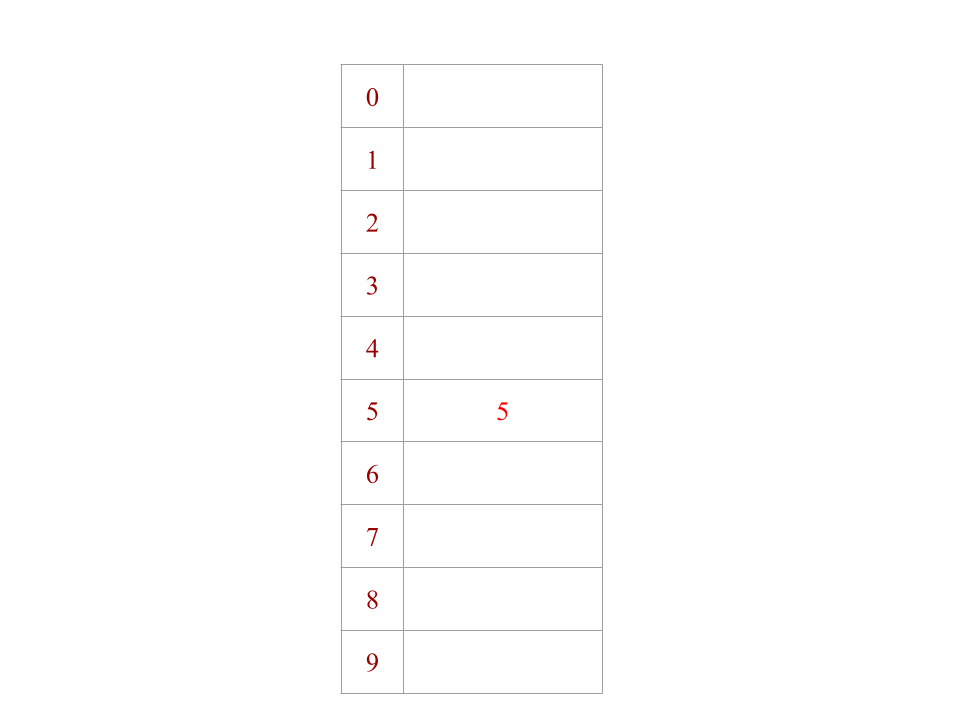
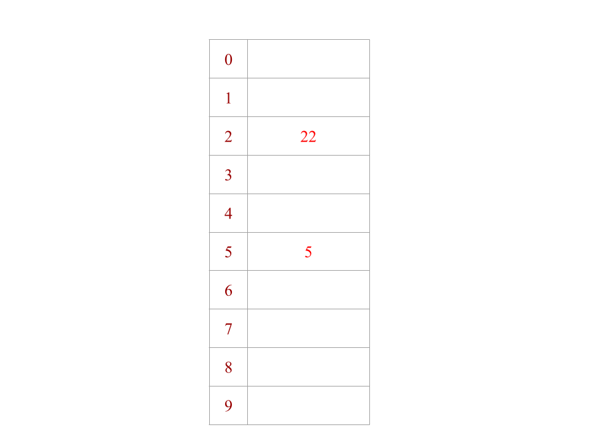
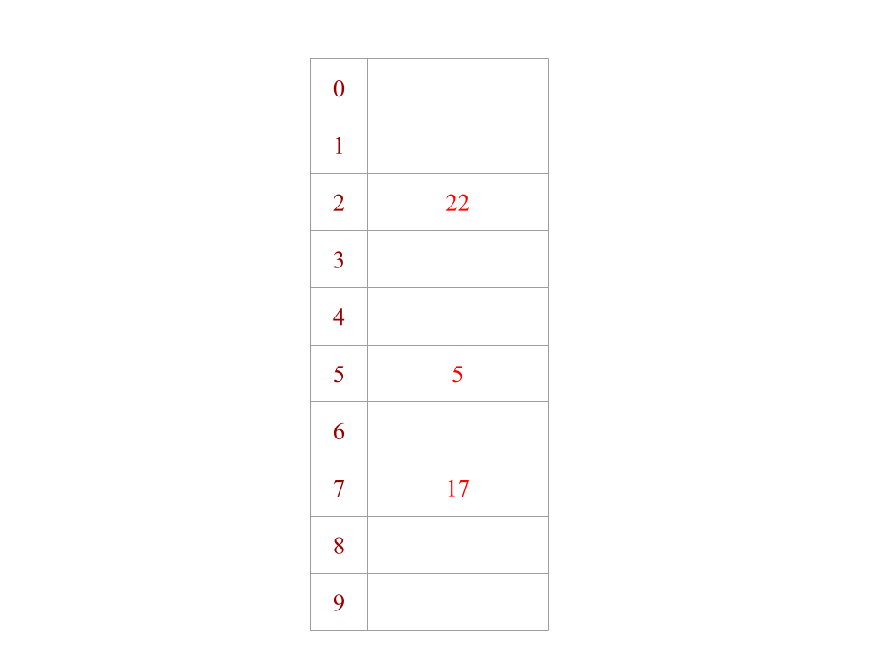
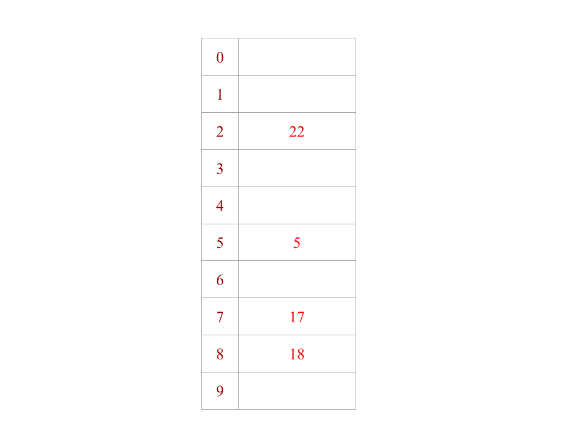
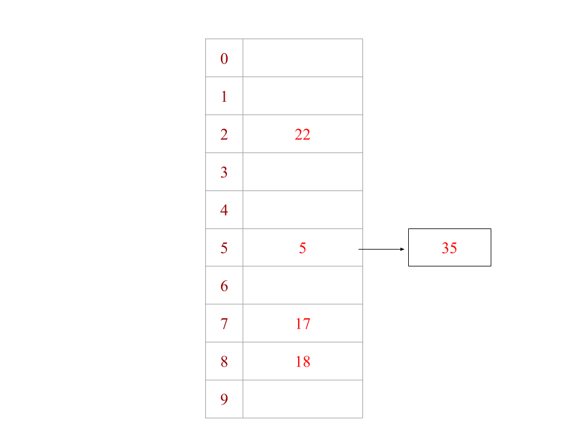
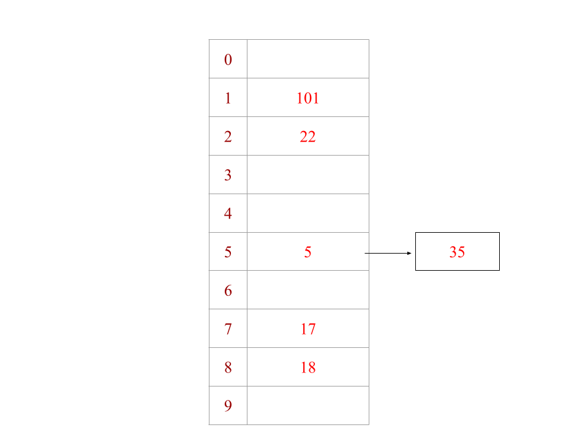
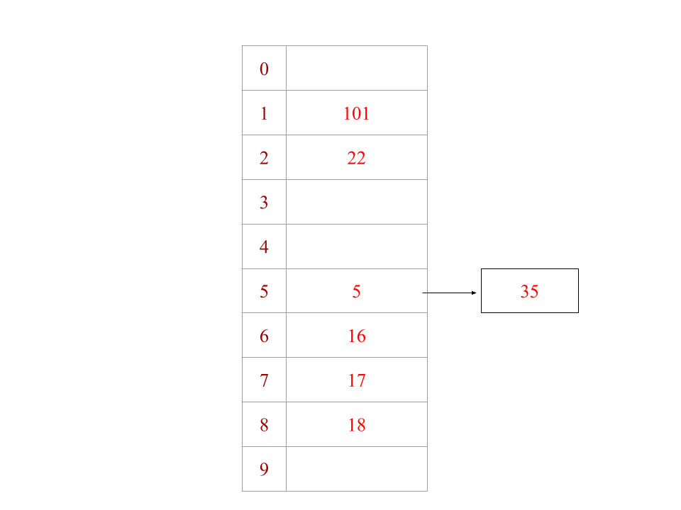
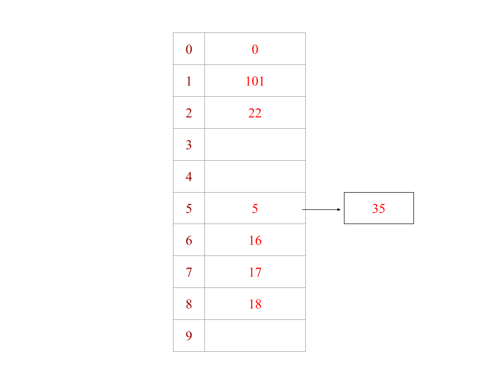
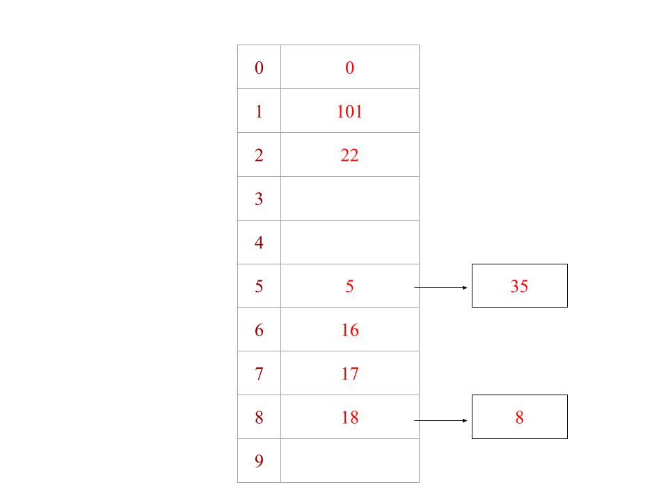

## Exercise 1: Open Hashing (Separate Chaining)
**May be harder to view with dark mode!!**

Given the following set of keys: **5, 22, 17, 18, 35, 101, 16, 0, 8**

- Initially create a hash table with size 10:

- 5 mod 10 = 5
  - place 5 into the index 5

- 22 mod 10 = 2
  - place 22 into the index 2

- 17 mod 10 = 7
  - place 17 into the index 7

- 18 mod 10 = 8
  - place 18 into the index 8

- 35 mod 10 = 5
  - index 5 is occupied so 35 added to the linked list at index 5

- 101 mod 10 = 1
  - place 101 into the index 1

- 16 mod 10 = 6 
  - place 16 into the index 6  

- 0 mod 10 = 0
  - place 0 into the index 0

- 8 mod 10 = 8
- index 8 is occupied so 8 added to the linked list at index 8
