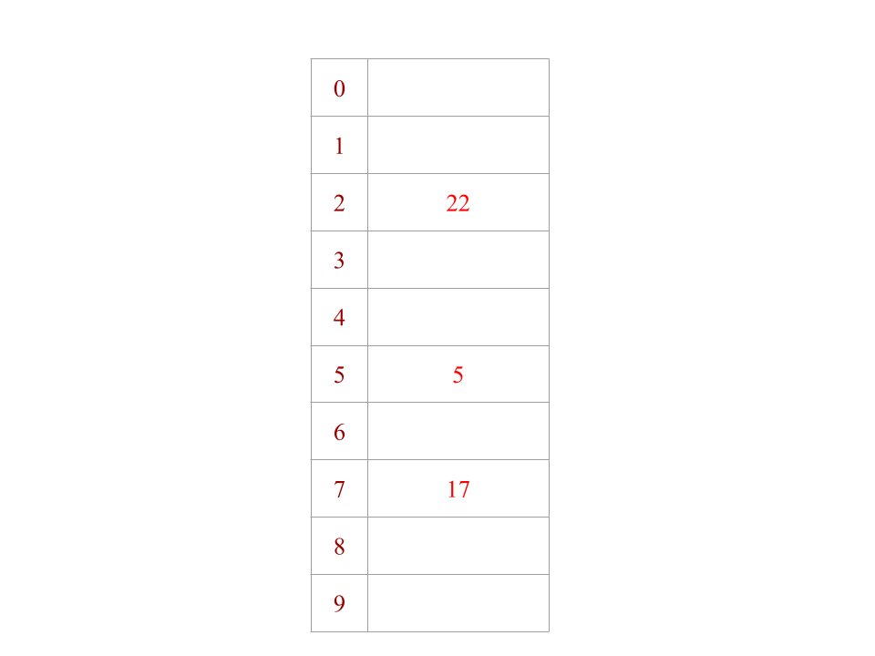
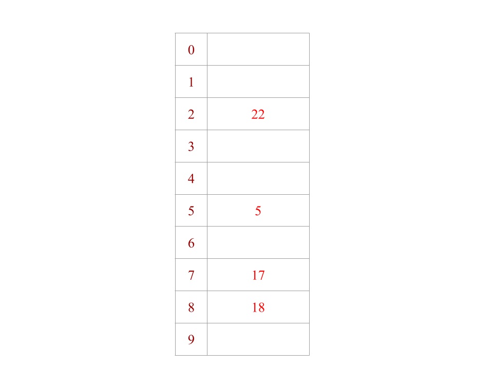

## Exercise 2: Closed Hashing (Open Addressing)
**May be harder to view with dark mode!!**

**5, 22, 17, 18, 35, 101, 16, 0, 8**

- 5 mod 10 = 5

- 22 mod 10 = 2

- 17 mod 10 = 7

- 18 mod 10 = 8

- 35 mod 10 = 5

- 101 mod 10 = 1

- 16 mod 10 = 6

- 0 mod 10 = 0

- 8 mod 10 = 8
