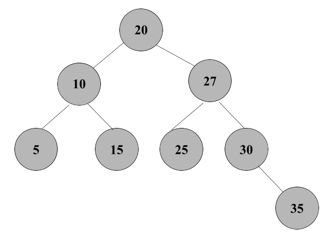

# Insert the following values in order:
**10, 20, 30, 15, 25, 5, 35, 27**

------------------------------------------------------------------------------------
## Insert 10
- Insert 10 into the empty tree ; *the root*

## Insert 20
- 20 is greater than 10, so 20 is the right child of 10 
  - Balance factor of 10: 0 - 1 = -1 ; *no rotation needed*

## Insert 30
- 30 is greater than 10 and 20, so 30 is the right child of 20
  - Balance factor of 10: 0 - 2 = -2 ; *left rotation at 10 needed*

### After the RR Rotation

## Insert 15
- 15 is less than 20, so 15 is the left child of 20
  - Balance factor of 20: 1 - 1 = 0 ; *no rotation needed*

## Insert 25
- 25 is more than 20 and less than 30, so 25 is the left child of 30
  - Balance factor of 20: 1 - 2 = -1 ; *no rotation needed*

## Insert 5
- 5 is less than 20 and 10, so 5 is the left child of 10
  - Balance factor of 20: 2 - 2 = 0 ; *no rotation needed*

## Insert 35
- 35 is more than 20 and 30, so 35 is the right child of 20
  - Balance factor of 20: 2 - 3 = -1 ; *no rotation needed*

## Insert 27
- 27 is more than 20 and 25, so 27 is the right child of 25
  - Balance factor of 30: 1 - 2 = -1 ; *no rotation needed* 

### Balance out the AVL Tree
- 25 is the parent of 27, but is less than 27. So we'd swap them. 

- Balance factor of 30: 2 - 0 = 2 ; *right rotation at 30 needed*

### After the LL Rotation

